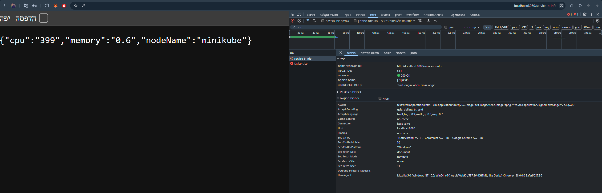

# 🚀 WSC Sports – DevOps Exam Solution

This solution demonstrates a local Kubernetes deployment using Minikube with two services:  
**Service A** (a Flask web service) and **Service B** (a CPU-consuming pod).  
Service A exposes an endpoint `/service-b-info` which returns:

- CPU usage
- Memory usage
- Node name of Service B

---

## 🗂 Folder Structure

```
wcs-sports/
│
├── screen-shots/
│   ├── CURL.png          # Screenshot of curl response
│   └── WEB.png           # Screenshot of terminal output
│
└── wcs/
    ├── Makefile          # (Optional bonus task)
    ├── README.md         # ← You are here
    ├── helmchart/
    │   ├── Chart.yaml
    │   ├── values.yaml
    │   └── templates/
    │       ├── deployments.yaml
    │       ├── service.yaml
    │       ├── serviceaccount.yaml
    │       ├── rbac.yaml
    │       ├── role.yaml
    │       ├── rolebinding.yaml
    │       └── hpa.yaml
    └── service-a-app/
        ├── app.py
        ├── Dockerfile
        └── requirements.txt
```

---

## 🎯 Objective

- Deploy **Service A** exposing `/service-b-info`
- Deploy **Service B** consuming CPU
- From Service A, return:
  - Current CPU usage of Service B (in mCores)
  - Memory usage (in MB)
  - Node name where Service B runs

---

## 🧰 Prerequisites

Make sure you have the following installed:

| Tool      | Required |
|-----------|----------|
| Docker    | ✅        |
| Minikube  | ✅        |
| kubectl   | ✅        |
| Helm      | ✅        |

Enable the metrics server in Minikube:

```bash
minikube addons enable metrics-server
```

---

## 🚀 Setup & Deployment

### 1. Start Minikube

```bash
minikube start
```

### 2. Use Minikube Docker

```bash
eval $(minikube docker-env)
```

### 3. Build Service A Image

```bash
cd wcs/service-a-app
docker build -t service-a:v0.0.5 .
```

### 4. Create Namespace

```bash
kubectl create namespace wcs
```

### 5. Deploy via Helm

```bash
cd ../helmchart
helm install wsc-devops-exam . -n wcs
```

---

## 🔎 Testing `/service-b-info`

### 1. Port Forward

```bash
kubectl port-forward svc/service-a 8080:8080 -n wcs
```

### 2. Curl the Endpoint

```bash
curl http://localhost:8080/service-b-info
```

### ✅ Example Output

```json
{
  "nodeName": "minikube",
  "cpu": "300",
  "memory": "50"
}
```

---

## 📸 Screenshots

| CLI Curl Output                          | Terminal Logs                            |
|------------------------------------------|-------------------------------------------|
|         |            |

---

## 🔐 Production-Readiness Features

- ✅ Helm chart templating
- ✅ Dedicated Kubernetes namespace (`wcs`)
- ✅ RBAC: ServiceAccount, Role, ClusterRoleBinding
- ✅ Horizontal Pod Autoscaler for Service B
- ✅ CPU & Memory limits defined
- ✅ Error handling in Flask API
- ✅ Metrics pulled from `metrics.k8s.io` API
- ✅ Clean separation of code & infra

---

## 🧪 Optional Bonus Features

- ✅ HPA (Horizontal Pod Autoscaler)
- ✅ Makefile (for `make install` / `make uninstall`)

---

## 🧹 Cleanup

```bash
helm uninstall wsc-devops-exam -n wcs
kubectl delete namespace wcs
```

---
## 👤 Author

**Almog Levinshtein**
